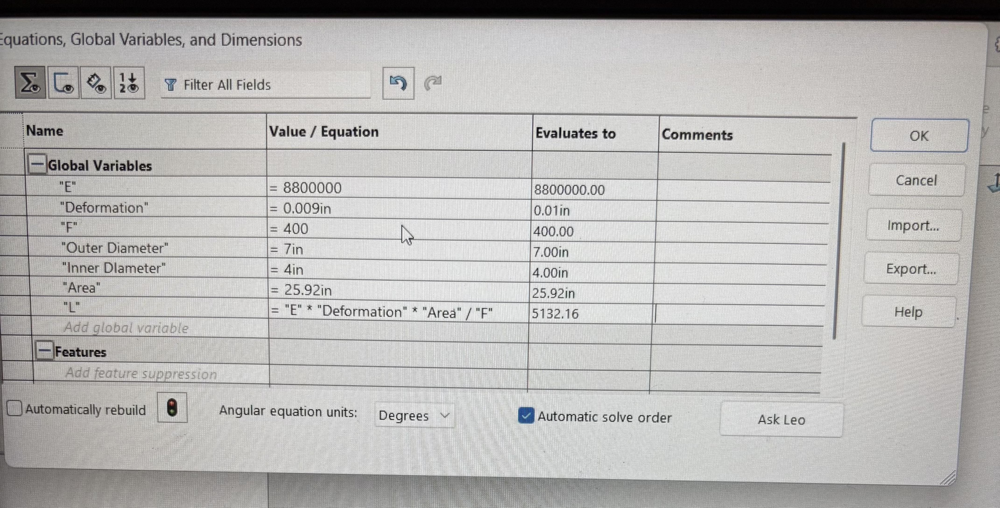
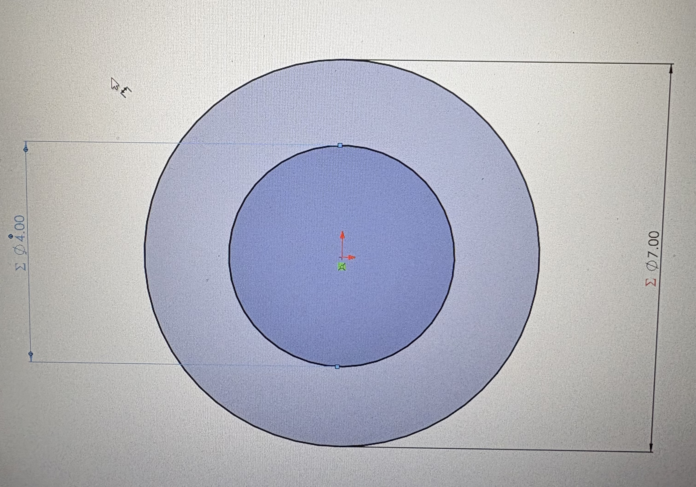
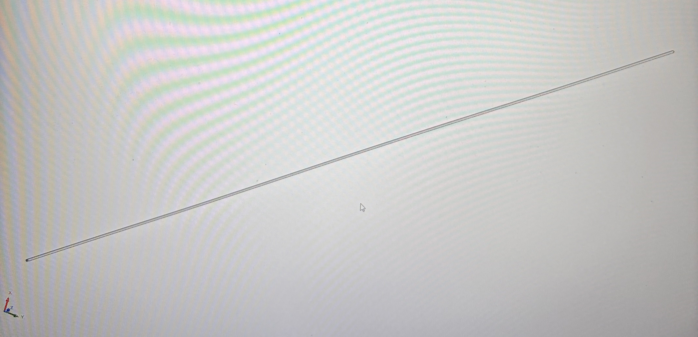
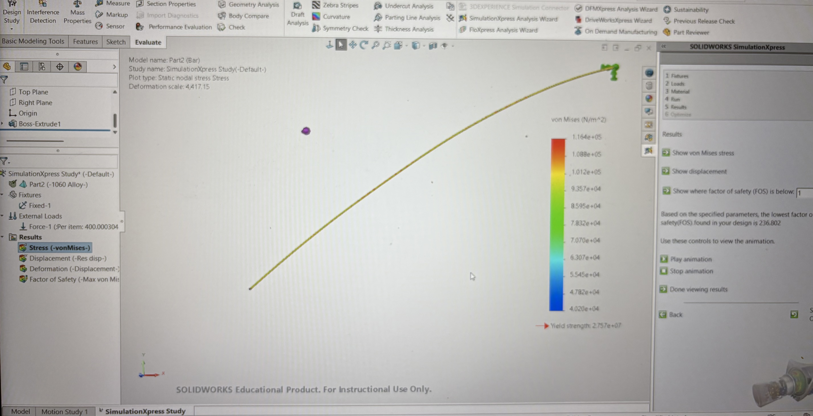
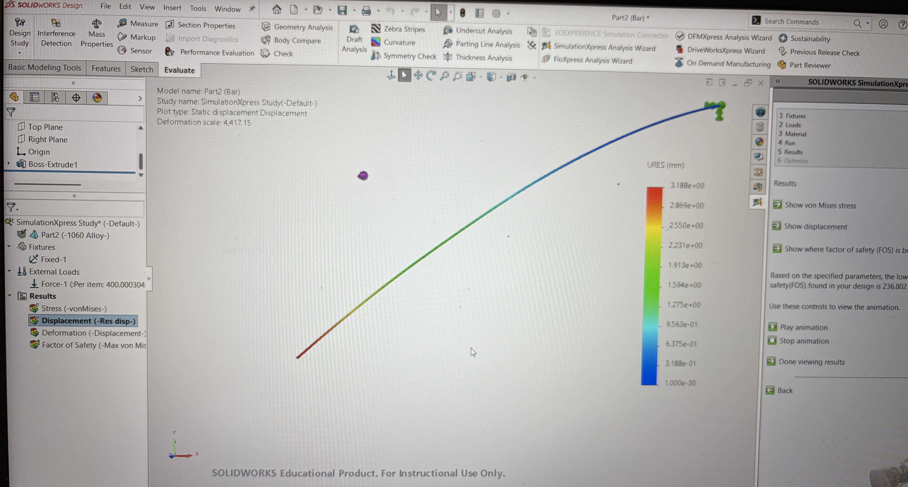
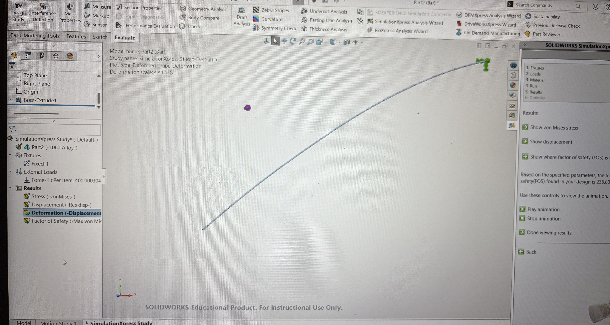
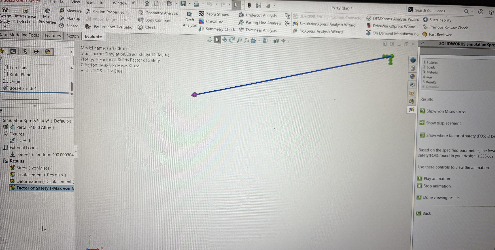

# A3 – Parametric and FEA

## Parametric Design
For this assignment, I had to parametrically design a bar in CAD. For the load, I was given a choice anywhere from 300lb-500lb, and I chose 400lb. The max axial deflection was 0.009in. It was also stated that the bar be designed from Aluminum with a range of Young's Modulus from (8.5-11.5) X 10^6 psi. I chose an outer diameter of 7in and an inner diameter of 4in for my aluminum bar. I used the area equation for a hollow circular cross section to calculate my area of 25.92in^2. From these dimensions, I also was able to get the thickness which was 1.5in. 

For my calculations, I chose an applied force of 400lb, which is within the range required for the assignment. I used a modulus of elasticity of 8.8 x 10^6 psi and the maximum deflection of 0.009in. Using the direct tension elongation equation and my area of 25,92in^2, I solved for the bar length and got 5,132.16in.

## CAD Parameters
I entered my calculated values into SolidWorks as global variables so the dimensions of the bar would be controlled parametrically. i used an elastic modulus of 8.8 x 10^6 psi, a maximum deformation of 0.009in, a 400lb load, and outer and inner diameters of 7in and 4in. I then linked these values to my dimensions and used the equation L = (E)(Deformation)(Area)/(F), which gave me a bar length of 5,132.16in. This allowed SolidWorks to automatically generate the bar based on the values from my calculations.

## FEA/CAD Designs
I generated a von Mises stress map using the same 400lb load from my original calculations. The maximum stress from the FEA was about 1.164 x 10^5 N/m^2, which is much lower than the 40ksi strength of aluminum given in the assignment. This showed that my bar could safely handle the applied load without exceeding the material strength.

I created a displacement map to see how much the bar moved under the 400lb load. The simulation showed a maximum resultant displacement of about 3.188mm, or 0.1255in. The colors show how the displacement changes along the length of the bar. I am aware that I probably did this part wrong and I was trying to fix it but didn't know what to do.

I also viewed the deformed shape to see how SolidWorks represented the bar's movement. The deformation is shown at a scale of 4,417.15, so the bending shown on the screen is greatly exaggerated and is not the actual shape the bar would take. This view helped me visualize where the deformation took place.

Lastly, I checked the factor of safety using the maximum von Mises stress. SolidWorks calculated the lowest factor of safety as 236.802, which is much greater than 1. However, the assignment requires comparison to an aluminum strength of 40ksi, so I separately checked the FEA maximum stress against 40ksi. The maximum stress was still far below 40ksi, so the design passes the strength requirement.

## Design Reflection
From my parametric hand calculation, I used a maximum axial deflection of 0.009in as provided. I used 8.8 x 10^6 psi for my elasticity, a cross-sectional area of 25.92in^2, and a load of 400lb, which gave me a calculated bar length of 5,132.16in. My SolidWorks FEA gave a maximum displacement of 3.188mm. I converted this to inches, and it became 0.1255in. I then calculated the percent difference using 2(0.1255-0.009)/0.1255+0.009 x (100) to then get a total percentage difference of 173.2%.

There was a large difference between my hand calculated deflection of 0.009in and my FEA displacement of 0.1255in. One likely reason is the difference in the loading and boundary conditions between the two methods. My hand calculation assumes that the 400lb force acts directly along the axis of the bar, while my SolidWorks results showed the bar bending. This means the FEA was most likely including bending displacement in addition to axial deformation, which caused a much larger displacement. 

For the intended design, I would trust my hand calculated result more for the axial deflection because the assignment is specifically based on direct axial tension. The equation I used directly relates to the load, length, area, modulus of elasticity, and axial deformation. Before trusting the FEA displacement more, I would need to make sure that the 400lb force was applied completely along the axis of the bar so that bending was not included in the result.

## Decide

## Communicate

