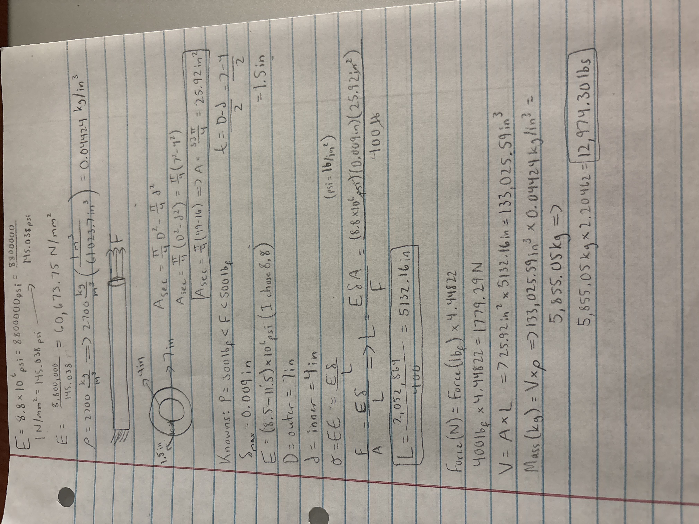

# A3 – Parametric and FEA

## Parametric Design
For this assignment, I had to parametrically design a bar in CAD. For the load, I was given a choice anywhere from 300lb-500lb, and I chose 400lb. The max axial deflection was 0.009in. It was also stated that the bar be designed from Aluminum with a range of Young's Modulus from (8.5-11.5) X 10^6 psi. I chose an outer diameter of 7in and an inner diameter of 4in for my aluminum bar. I used the area equation for a hollow circular cross section to calculate my area of 25.92in^2. From these dimensions, I also was able to get the thickness which was 1.5in. 

For my calculations, I chose an applied force of 400lb, which is within the range required for the assignment. I used a modulus of elasticity of 8.8 x 10^6 psi and the maximum deflection of 0.009in. Using the direct tension elongation equation and my area of 25,92in^2, I solved for the bar length and got 5,132.16in.

## Analyze

## Decide

## Communicate

