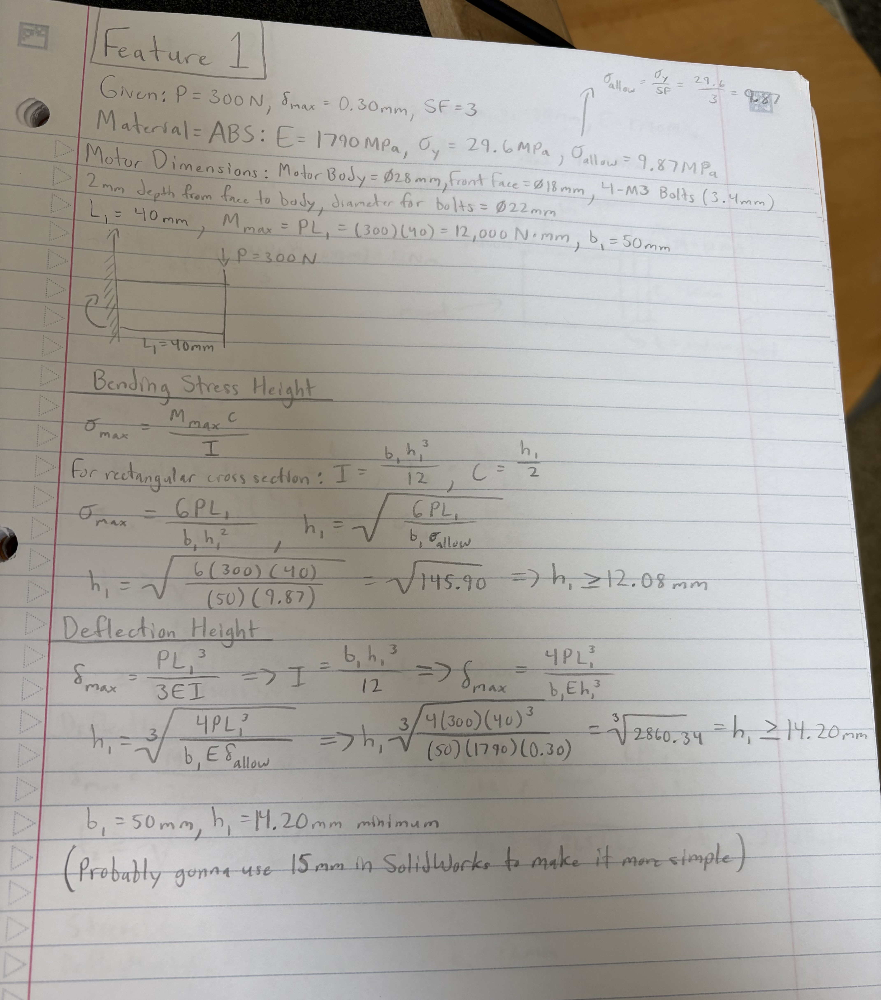
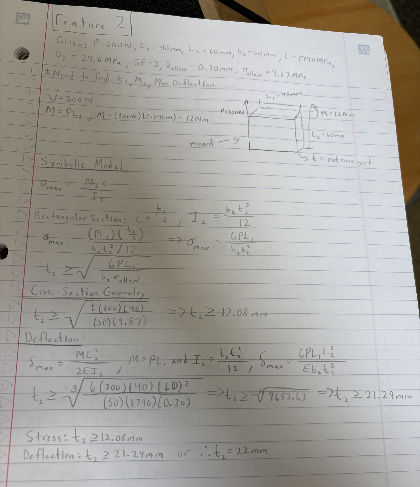
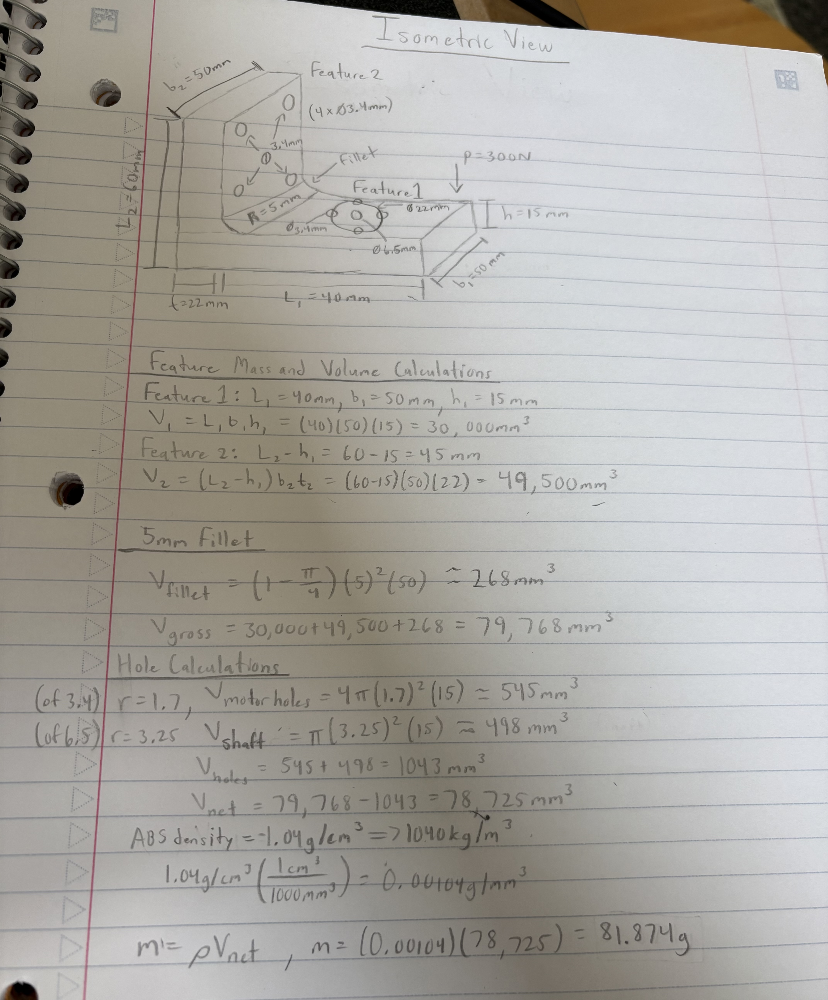
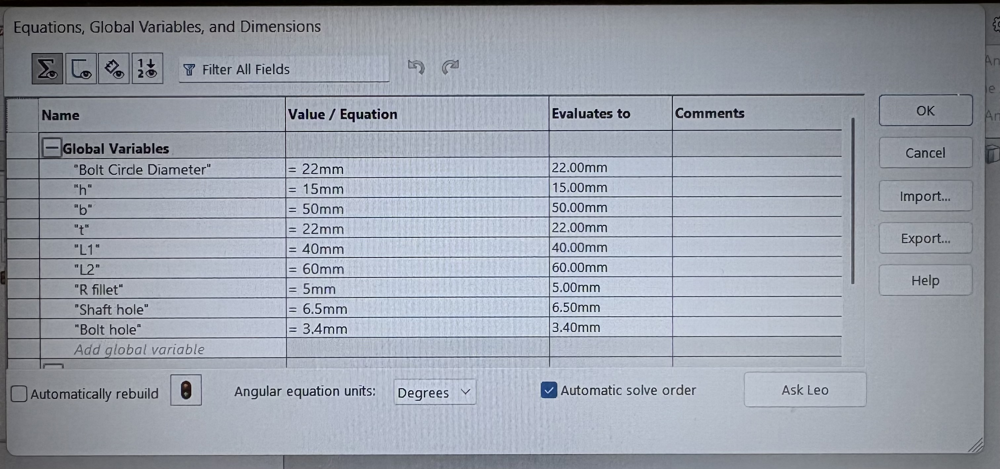
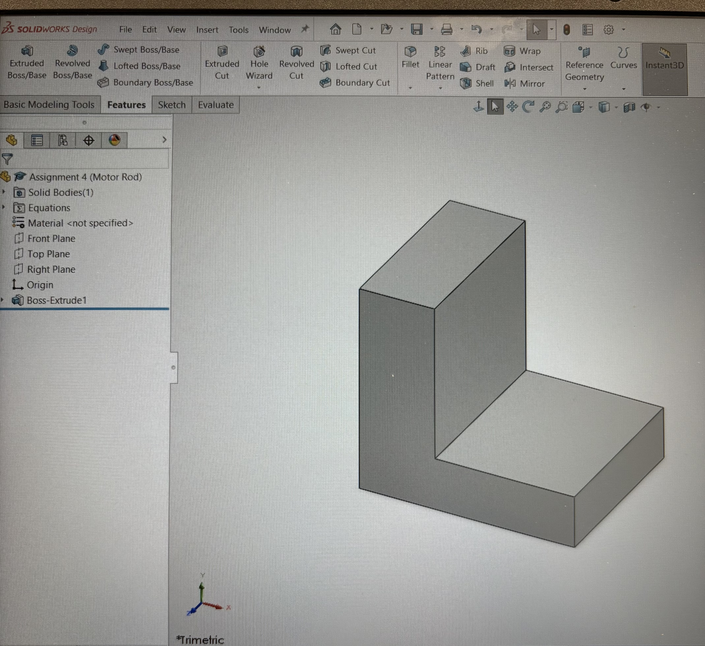
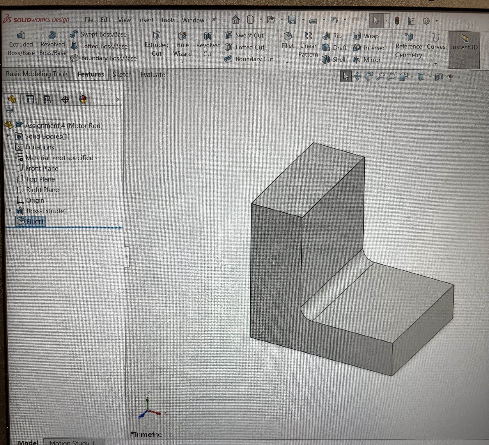
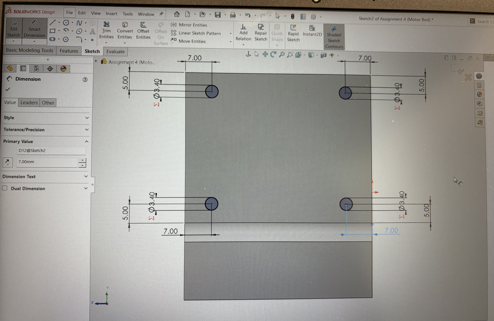
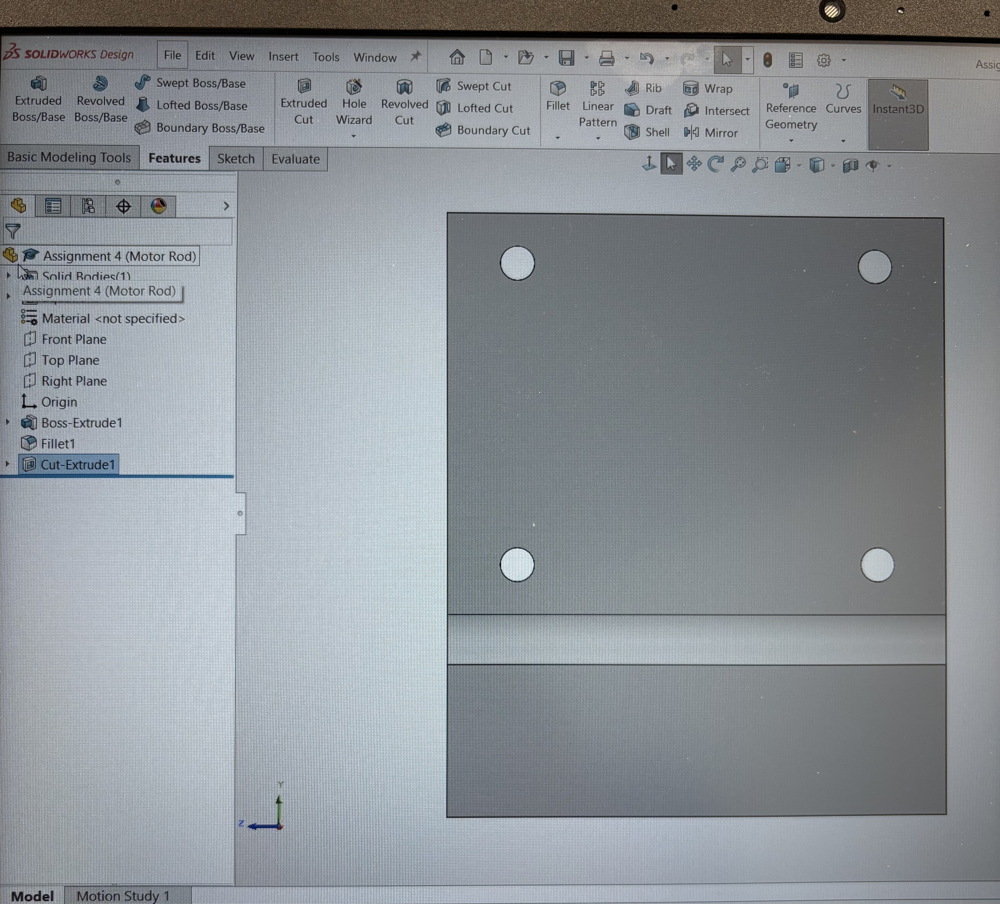
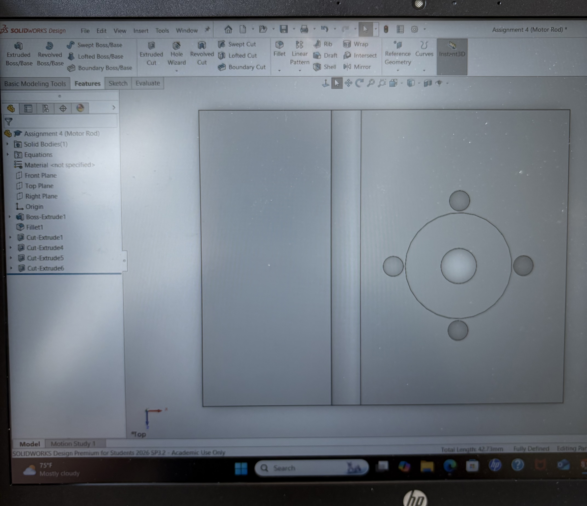
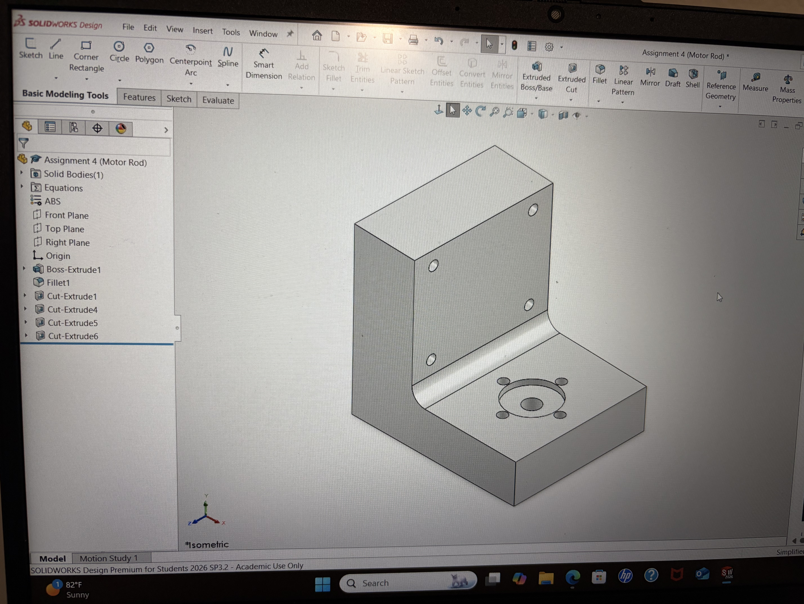

# A4 – Motor Mount

## Objective
The objective for this assignment was to design a motor mount for a (Brushed 24V DC Gear Motor 3.6Kg.cm/46RPM w/ 99.5:1 Planetary Gearbox), which is attached to a rigid wall. The main goal was for the motor mount to be designed to withstand the 300N load without exceeding the allowable stress or deflection. I used beam bending equations and the properties of ABS to determine the dimensions needed for the two main features. I then used my calculated dimensions to sketch and create the motor mount in SolidWorks using parametric modeling.

## Analyze
## Motor Mount Research
I researched different motor mount designs before making my final design. I found that many DC gear motor mounts use an L-shaped bracket with mounting holes to secure the motor and attach the bracket to a wall or frame. I used this general idea for my motor mount because it gives the motor a solid mounting surface while still allowing the shaft to extend out from the front. I also used multiple bolt holes so the mount would stay secure and resist movement from the motor torque.

I also looked at designs that support the motor around its mounting face instead of only supporting one small area. This helped me decide to make the mount wide enough to support the motor and add material around the mounting holes. My final dimensions were then based on the strength and deflection calculations instead of copying the dimensions of an existing motor mount. I had ChatGPT help me find a couple links for my research.

Carnegie Mellon - This is a strong research source because it specifically discusses mounting small gearmotors and shows examples where the motor's mounting face is secured to a panel using screws. 
[Carnegie Mellon - Gearmotor Mounting](https://courses.ideate.cmu.edu/16-223/f2025/text/mechanism/gearmotors.html)

L-Shaped Planetary Motor Mount - This is useful for explaining my soon to be L-shaped design. The example uses an L-shaped bracket, a center opening for the motor/shaft area, four motor mounting holes, and slots for attaching the bracket to another structure. 
[L-Shaped Planetary Motor Mount](https://robotdoo.com/products/42mm-planetary-gear-motor-mounting-bracket)
## Feature 1
For Feature 1, I used ABS as my material and used its yield strength and modulus of elasticity in my calculations. I used a safety factor of 3 to get an allowable stress of 9.87MPa. I then checked the required height based on both bending stress and deflection. The deflection calculation controlled and gave me a minimum height of 14.20mm, so I rounded it up to 15mm to make it simpler in SolidWorks. I also used 40mm for the length and 50mm for the width of Feature 1.

## Feature 2
For Feature 2, I used the same ABS material, safety factor of 3, and allowable stress of 9.87MPa. I calculated the required thickness using both bending stress and deflection. The stress calculation gave me a minimum thickness of 12.08mm, while the deflection calculation gave 21.29mm. Since deflection required the larger value, I rounded the thickness up to 22mm for my SolidWorks model. I used 60mm for the height(or length), and 50mm for the width of Feature 2.

## Isometric Sketch
I created an isometric sketch of my motor mount using the dimensions that I had calculated for both Features 1 and 2. I included all the previous dimensions, including the 5mm fillet. I also wanted to emphasize the importance of the proper dimensions for the bolt holes and shaft hole. After my sketch, I calculated the volume of the mount, subtracted the volume of the holes, and used the density of ABS to estimate the final mass of the mount.

## CAD Model(s)
I started by setting up my global variables for the main dimensions for my motor mount. This made it easier to keep the dimensions from my calculations consistent throughout the model.

I created the basic L-shape of the motor mount using the dimensions I calculated earlier. I then extruded the sketch to 50mm wide to create the main body of the mount.

Next, I added a 5mm fillet to the inside corner of the motor mount. This rounded the sharp inside corner and completed the main shape of the mount.

I then sketched the four mount holes on the vertical section of the mount. I made each hole 3.4mm in diameter and located them 7mm from the side edges and 5mm from the top or bottom edges before cutting them through the part.

After defining the hole locations, I used an extruded cut to create all four holes through the vertical section. These 3.4mm holes are the clearance holes for the M3 bolts used to attach the mount.

Finally, I created the holes on the horizontal section where the motor will be positioned. I used an 18mm diameter for the motor face opening, a 6.5mm diameter for the shaft hole, and four 3.4mm bolt holes around the center. This completed the main geometry and mounting features of my CAD model(s).

This is my complete and finished CAD model motor mount. It is made of ABS material and has all of my calculations and dimensions that I have solved.

## Drawings for my 3D CAD Model
For the final drawing, I added the different views of my motor mount to show the overall shape and dimensions of the part. I included the top, front, side, and isometric views so the hole locations and main features can be clearly seen. I also added the important dimensions, including the overall size, hole diameters, hole locations, and the fillet. This drawing shows the final design and gives the dimensions needed to understand how the part was made.

[Download my SolidWorks Motor Mount Model](https://github.com/awayne1-eng/megr2157-portfolio/blob/main/docs/assignments/A04/Assignment%204%20(Motor%20Rod).SLDPR)

[Download my SolidWorks Motor Mount Model Drawings and Dimensions](https://github.com/awayne1-eng/megr2157-portfolio/blob/main/docs/assignments/A04/Assignment%204%20(Motor%20Rod).SLDDRW)

## Engineering Lesson Learned
During this assignment, I learned how important the material and dimensions are when designing a part. I learned how to use the yield strength and elasticity of ABS along with a factor of safety to determine the dimensions for my motor mount. I also got more SolidWorks experience by creating the different features, and adding fillets and holes, and by making the final drawing. Overall, the assignment helped me understand how the calculations and CAD Model work together to create a well finished design.

This assignment roughly took me 7-8 hours to complete.

