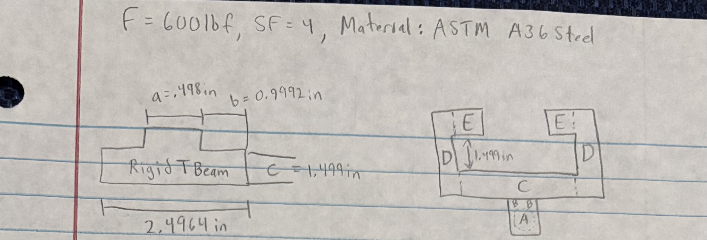
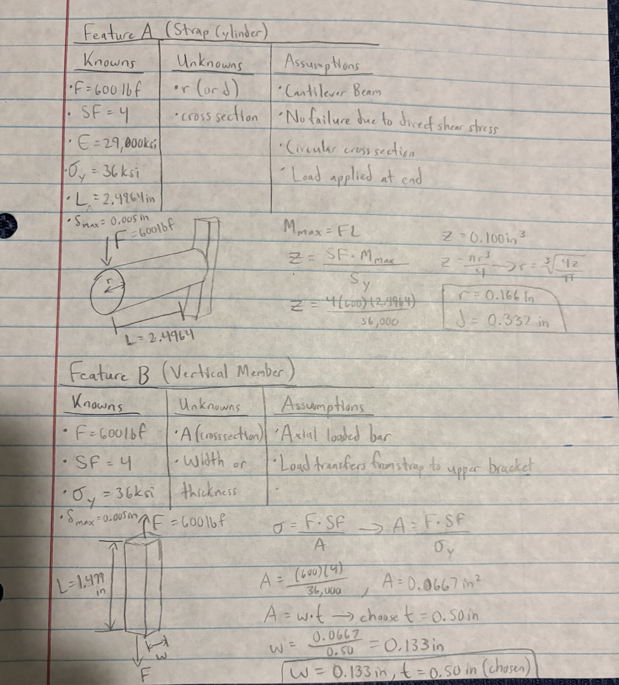
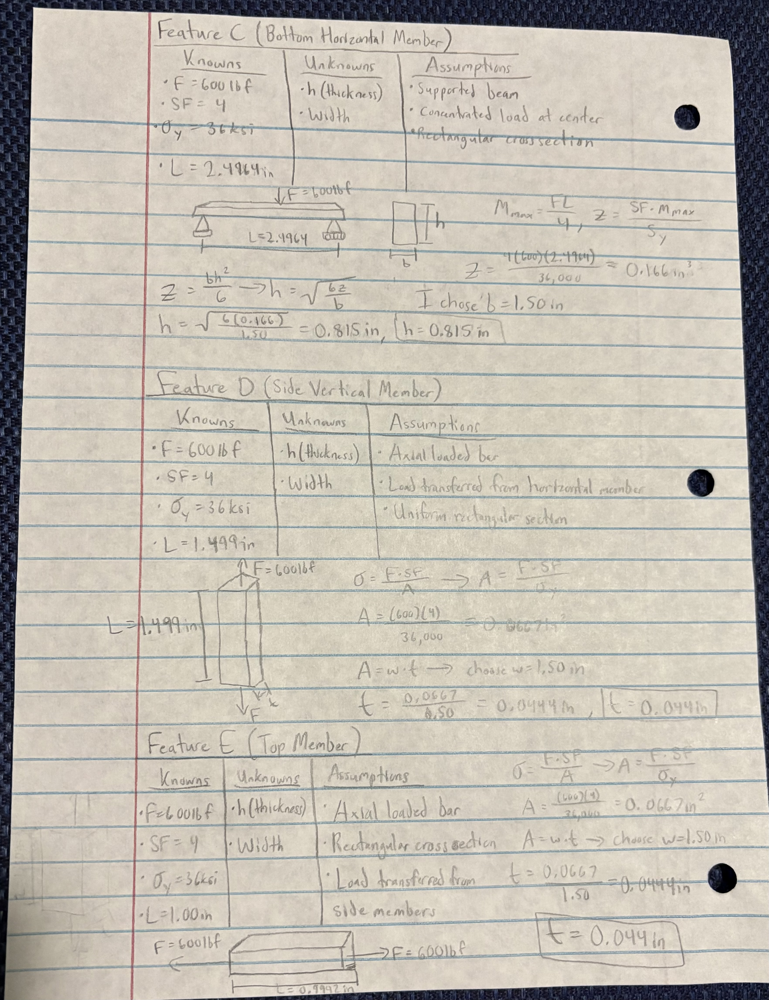
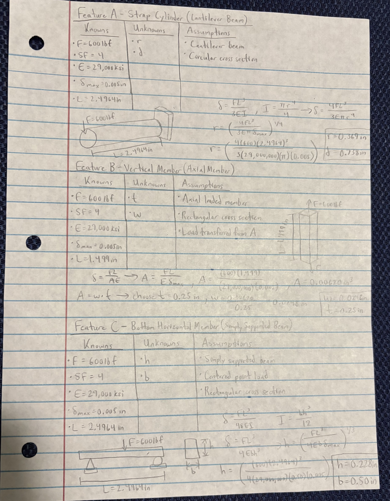
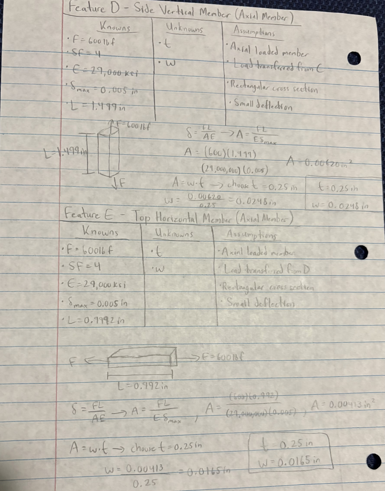
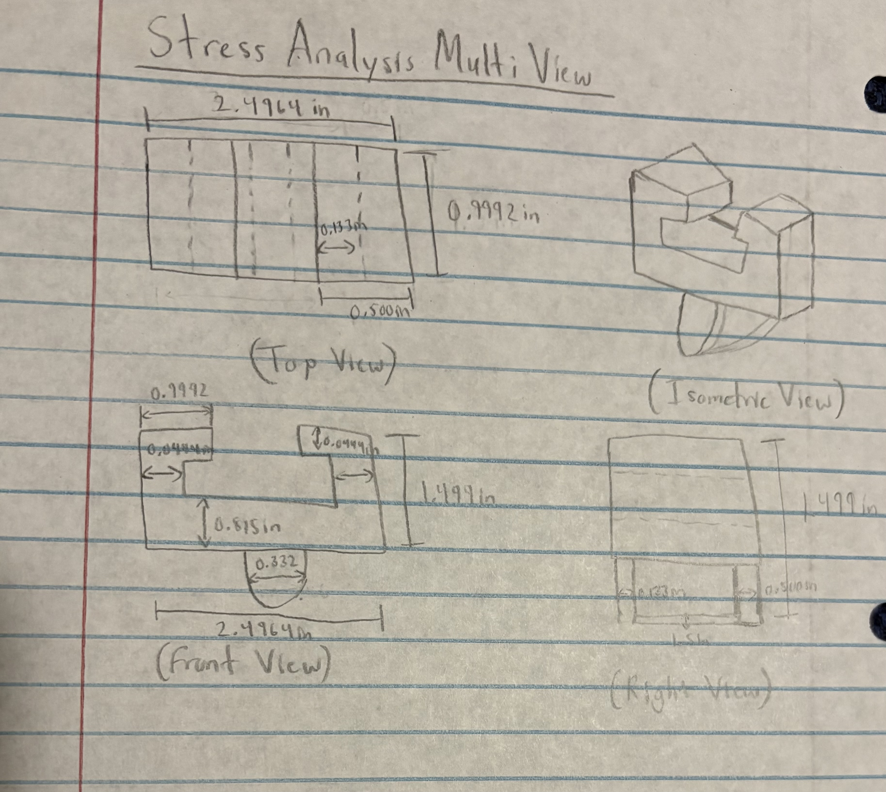
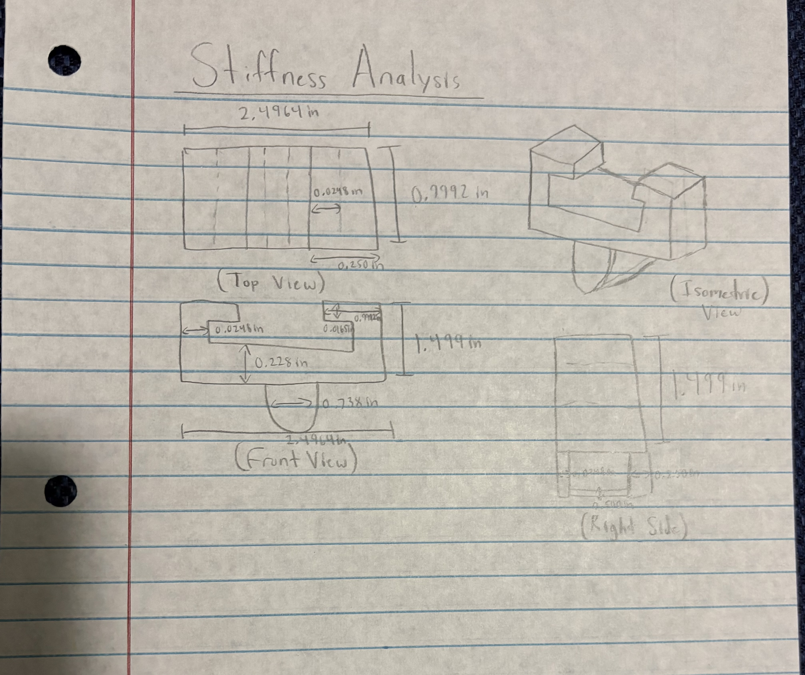
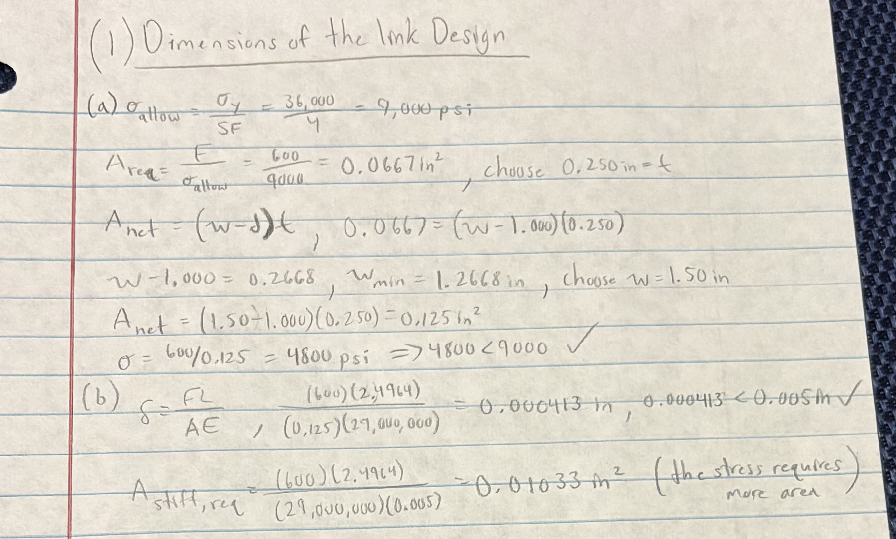

# A5 – [Bracket Design]

## Objective
Conduct stress analysis to determine appropriate dimensions for structural features.

Generate free body diagrams (FBDs) to visualize forces and constraints for each feature.\

Identify and document known and unknown variables, assumptions, and algebraic models for stress calculations.

Perform stiffness analysis to establish minimum required dimensions based on deflection constraints.

Compare stress and stiffness analyses to ensure structural integrity and compliance with given constraints.

Create detailed multiview sketches illustrating dimensions derived from both stress and stiffness analyses.

Reflect on and document key engineering lessons learned throughout the process.

## Analyze
## Bracket Design Intro
I started my bracket design by laying out each feature and finding the dimensions that I would need. I used the given 600lbf force, a safety factor of 4, and ASTM A36 Steel to calculate the proper sizes for each feature before putting the full bracket together.

## Stress Analysis
For the stress analysis, I looked at each feature A through E separately to determine the minimum dimensions needed to handle the applied load. I used the 600lbf force, safety factor of 4, and the 36ksi yield strength of ASTM A36 steel in my calculations. Feature A was analyzed as a cantilever cylinder, Feature C as a simply supported beam, and Features B, D, and E as axial members. After finding the required dimensions for each feature, I used those values to put together my final stress design for the bracket.

## Stiffness Analysis
For the stiffness analysis, I looked at each feature A through E separately to determine the dimensions needed to keep the bracket from deflecting too much. I used the 600lbf force, 29,000ksi modulus of elasticity for ASTM A36 steel, and the maximum deflection of 0.005in in my calculations. Feature A was analyzed as a cantilever cylinder, Feature C as a simply supported beam, and Features B, D, and E as axial members. After finding the required dimensions for each of these features, I used the final values to get my final stiffness design for the bracket.

## Stress and Stiffness Multi-View Sketches
For my stress analysis, I used the dimensions I calculated for each feature and put them together into one complete bracket design. I drew the top, front, right, and isometric views to show how all of the features fit together and where each calculated dimension is located. For my stiffness, analysis, I did the same process but used the dimensions I calculated from the maximum deflection requirements. I then drew the top, front, right, and isometric views to show how the stiffness dimensions changed the final size of the bracket compared to the stress design.

## Decide

## Communicate
## Lessons Learned
For my design, I found that stiffness governed the final size for Feature A. The stress analysis only required a diameter of 0.332in, while the stiffness analysis required a diameter of 0.738 in. This showed me that even if a part is strong enough to not yield, it can still need to be made larger to keep it from deflecting too much.

One thing I had to be careful about was using the correct dimensions from one feature when moving on to the next feature. Since the features connect together, using a wrong length or dimension earlier could change the calculations for the features after it. I checked my lengths and calculations before putting all of my dimensions together in the final multiview sketches.

One assumption I made was that ASTM A36 steel would be used for the entire bracket. The material properties were important because I used the yield strength for my stress calculations and the modulus of elasticity for my stiffness calculations. If I chose a material with different properties, some of my required dimensions would change, especially the dimensions controlled by stiffness.

This assignment took me 6-7 hours to complete.

## Fits (2157)
(1) For designing the dimensions of the link, I used the stress and deflection equations to find the dimensions needed for my link. I chose a width of 1.50in and a thickness of 0.250in, and my calculations showed that the link stays below both the allowable stress and maximum deflection, so the design should work safely.

(2) I selected a Close Running Fit (RC 4) based on ANSI B4.1-1967 (R1987) standards from the Machinery’s Handbook (ANSI/ASME Standard Limits and Fits, pp. 646–660). I chose this fit because it allows smooth movement between Feature A and the link without blinding while still keeping the connection close and accurate.
I would use precision reaming or CNC boring for the link hole and precision turning or grinding for the Feature A pin to achieve the required fit. I used this table in the handbook to help me. (ANSI B4.1 Table 1: Standard Running and Sliding Fits (RC 4).)

(3) For the 1.000 in shaft, I selected a light drive fit (FN1) based on ANSI B4.1-1967 (R1987) standards from the Machinery’s Handbook (ANSI/ASME Standard Limits and Fits, pp. 646–660). I felt like this was the best choice since it uses light pressure during assembly and creates a secure connection that helps prevent the shaft from slipping under the load. I would use precision machining and reaming to achieve the required tolerances for the shaft and hole.

