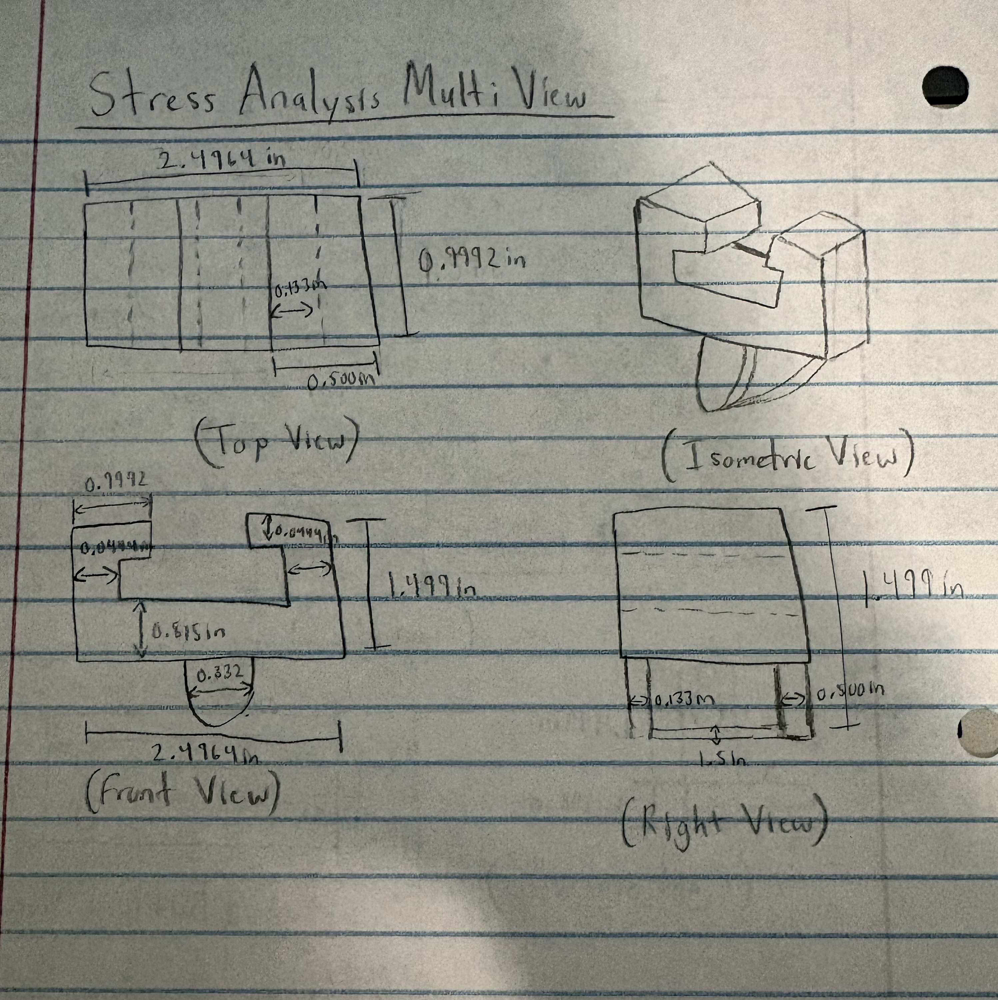
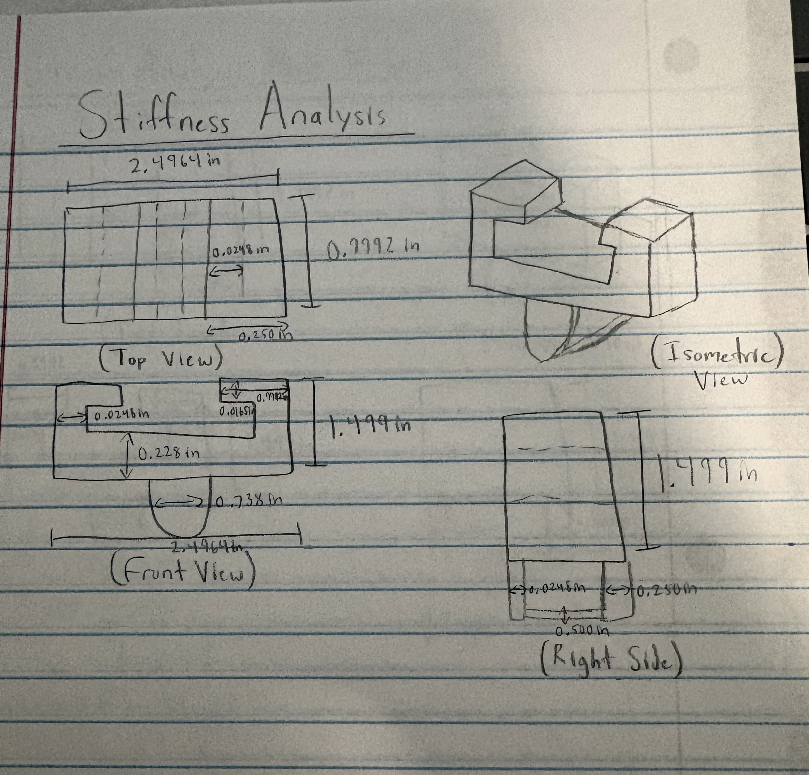
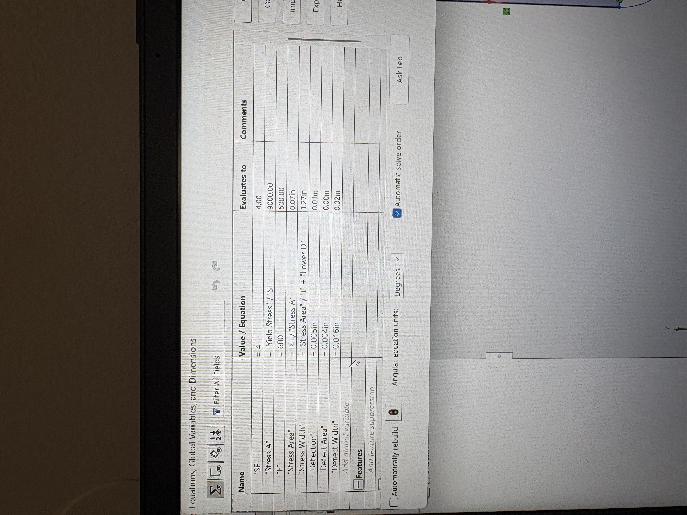
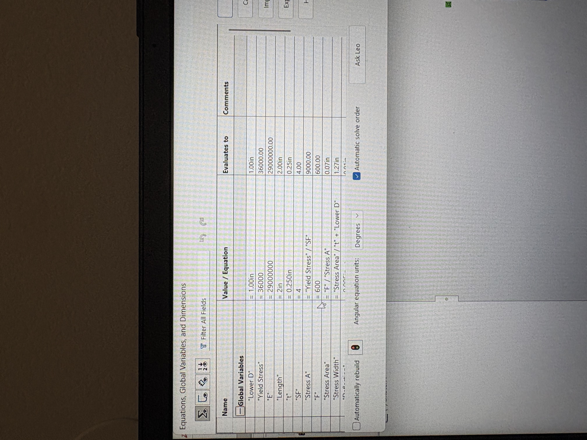
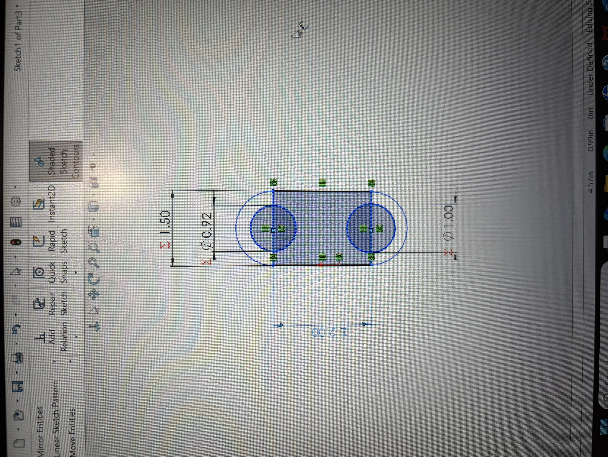
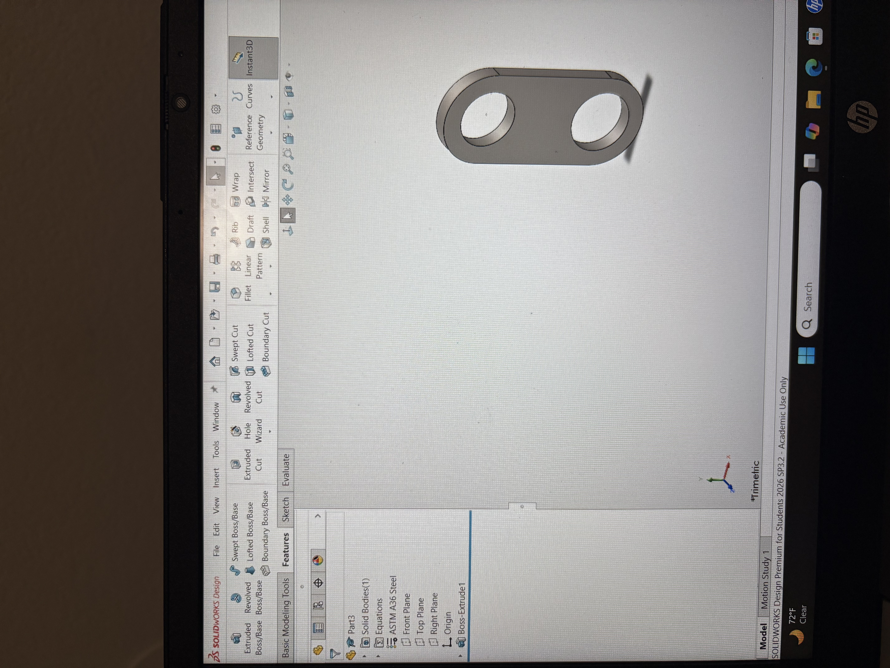
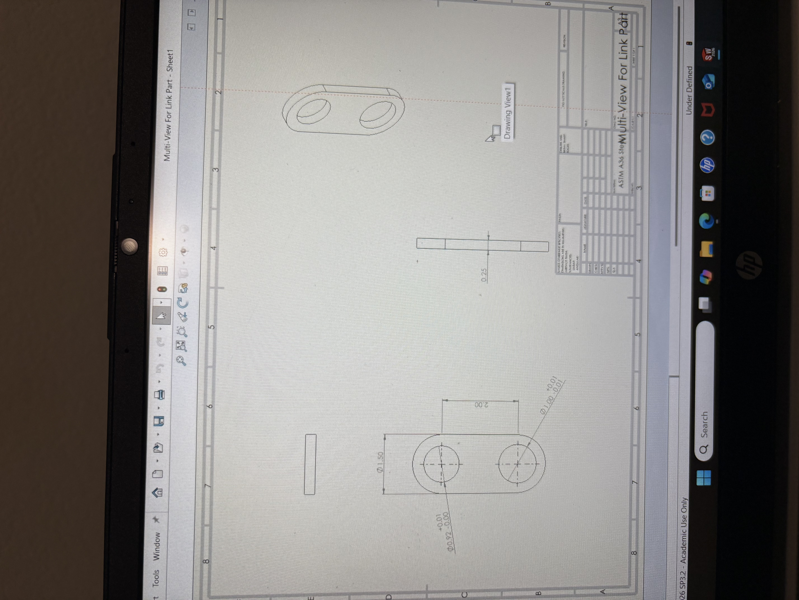

# A6 – [Bracket Drawings (Drawings Part 1)]

## Objective
The objective of this assignment is to continue my bracket design from the previous assignment and use my dimensions and calculations to create a parametric model in SolidWorks. I will also create a detailed multi-view engineering drawing of my bracket while making sure the design meets the required strength, stiffness, and tolerance requirements. 

## Parametric Design
From the previous assignment, I found the dimensions needed for my bracket to stay under the maximum deflection of 0.005in and to prevent failure from stress based on the material's yield strength. I compared my stress and stiffness analysis for each feature and used the dimension that would satisfy both requirements. Because of this, my final CAD model will use dimensions from both the stress and stiffness calculations.

## CAD Model and Multi-View Drawing for Bracket
I first started out by listing all my dimensions into my global variables so that I could start labeling my CAD model. So, I thencreated the final CAD model of my bracket design by combining all of the features from my previous calculations and sketches. I used the dimensions from my stress analysis to make sure the geometry matched the requirements. The bottom circular/semi-circle feature was added to represent the connection point, while the top opening was designed to allow the bracket to function as intended. I know I messed up on my CAD, but I tried to make it right best I could with my dimensions. Then, I created a multi-view drawing of my bracket to show the different views and important dimensions of the final design. I added tolerances to critical features, such as the radius and main dimensions. This helped show how the part should be made and how the different features need to fit together.
![My Image](
![My Image](
![My Image](
![My Image](
![My Image](
![My Image](

## Link Part for 2157
For the CAD model of the link, I created global variables using the equations feature in SolidWorks. These variables were used to connect my engineering calculations directly to the dimensions of the CAD model. The values were determined from the stress and stiffness analysis completed previously, with the stress analysis controlling the final link width because it resulted in the larger required dimension. 

## CAD Model and Multi-View Drawing
I created my link model in SolidWorks using the dimensions I got from my previous calculations. I used global variables to help control my sketch dimensions and make sure the CAD model matched my stress and deflection requirements. After finishing the model, I added the ASTM A36 steel material and created a multi-view drawing with the front, top, right, and isometric views, along with the important dimensions and tolerances.

## All of my CAD Models and Multi-View Drawings
[Download my SolidWorks Motor Mount Model](
[Download my SolidWorks Motor Mount Model]
[Download my SolidWorks Motor Mount Model]
[Download my SolidWorks Motor Mount Model]
## Link Part Reflection
I learned that tolerances are important because they help make sure parts will fit together correctly when they are manufactured. For my link design, adding tolerances to the holes and other important dimensions helped show which areas needed to be more precise for the connection to work properly. This assignment helped me understand how engineers use drawings and dimensions to communicate how a part should be made.

